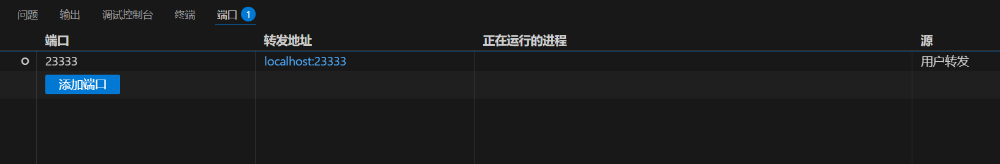
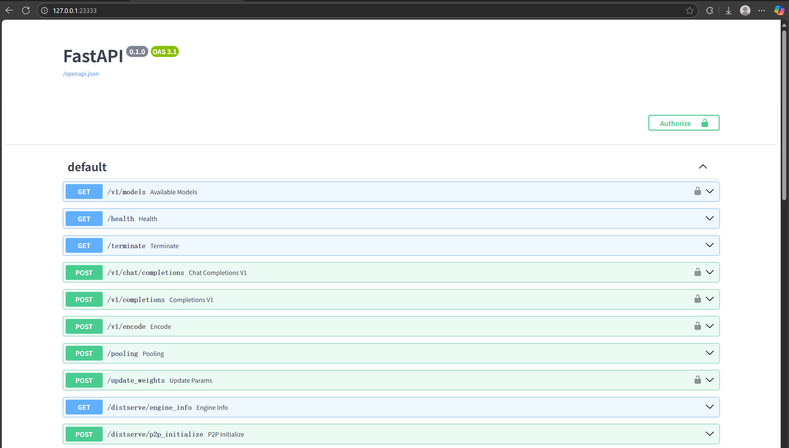
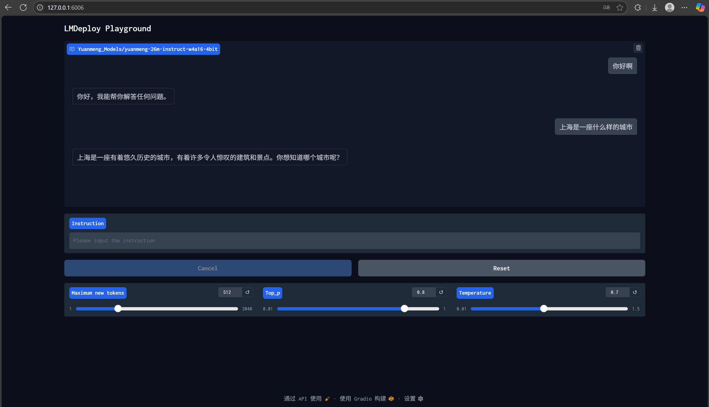

<p align="center">
  
</p>

<p align="center">
  <a style="color: white; font-weight: bold;">中文</a> | <a href="README_en.md">English</a>
</p>

<div align="center">
  <small><strong>涵盖：模型搭建 - 预训练 - 监督微调 - 推理 - 量化 - 部署 - Agent 应用</strong></small>
</div>

## 简介

大语言模型（Large Language Model, LLM）从开发到部署和应用，是多个技术细分方向的融合过程，涉及模型算法工程师、提示词工程师、Agent 应用开发工程师等多种角色。无论未来希望深入哪个方向，对于学习者而言，全面学习并实践 LLM 从模型搭建、开发到最终呈现给用户的完整工程流程至关重要。这不仅有助于加深对 LLM 技术体系的理解，也有利于在实际项目中更高效地优化模型效果、推动应用落地。遗憾的是，目前仍缺乏系统性、实战性强的教学资料或开源项目，能帮助进阶学习者掌握 LLM 全流程开发。为此，本项目旨在复现并梳理一套完整的 LLM 开发路径，源于本人在实践中的不断探索，帮助更多学习者少走弯路，未来也将持续更新与优化。

- 该项目是本人进阶学习 LLM 过程中的学习代码，建议学习者在开始前具备以下基础知识：PyTorch 深度学习、Transformer 架构、预训练与指令微调、模型量化以及 AI Agent 等相关内容。
- 项目完整走通了 LLM 的工业级落地全流程，包括：模型搭建、预训练、监督微调、推理、量化、部署及 Agent 应用开发。
- 本项目参考并基于以下三个优秀的开源项目进行构建与实现：
  - [https://github.com/jingyaogong/minimind](https://github.com/jingyaogong/minimind)
  - [https://github.com/InternLM/lmdeploy](https://github.com/InternLM/lmdeploy)
  - [https://github.com/langchain-ai/langgraph-codeact](https://github.com/langchain-ai/langgraph-codeact)
- 衷心感谢以上项目的开源贡献者，他们为本项目的构建提供了宝贵的参考与启发。

> 希望本项目能为大家提供实用的学习路径，助你成为 LLM 领域的专家！

---

## 快速开始

<details>
  <summary>本人的软硬件配置</summary>

  - CPU: 16 核，Xeon(R) Gold 6430  
  - 内存: 120 GB  
  - GPU: RTX 4090 / 24 GB  
  - CUDA == 11.3  
  - Python == 3.11.13  
</details>

### Ⅰ 环境配置

```bash
conda create -n myenv python=3.11.13
conda activate myenv
pip install -r requirements.txt -i https://pypi.tuna.tsinghua.edu.cn/simple
````

### Ⅱ 数据集下载

[数据集下载链接](https://www.modelscope.cn/datasets/gongjy/minimind_dataset/files) （minimind 项目提供）
创建 `./dataset` 目录，并把下载的数据集文件放到 `./dataset` 下，直接下载 `pretrain_hq.jsonl` 和 `sft_mini_512.jsonl` 两个数据集即可快速体验预训练与监督微调。

### Ⅲ 分词器（Tokenizer）

本人已经训练好了分词器在 `./model/yuanmeng_tokenizer` 下，词表大小为 6400。若非必要无需再自行训练。若需要训练，运行 `train_tokenizer.py`，并确保设备有 95 GB 以上内存。
本人亲测内存最高占用为 95 GB！训练时间为 22.5 分钟。

```bash
python train_tokenizer.py
```

### Ⅳ 预训练与监督微调

该步骤预训练并微调了一个“缘梦”大模型，以本人的网名命名，两个训练步骤均耗约45分钟（都是训练 1 个 epoch）。

**第一步：预训练学习语言知识**

```bash
python train_pretrain.py
```

> 运行预训练，得到 `pretrain_512.pth` 预训练输出权重

**第二步：监督微调（也称指令微调）学习对话方法**

```bash
python train_sft.py
```

> 运行监督微调，得到 `sft_512.pth` 监督微调输出权重

训练控制台输出效果如下：

```
The total number of parameters in the YuanMeng model is: 25.830 million
Epoch:[1/1](0/44160) loss:8.968 lr:0.000550000000 epoch_time:604.0min
Epoch:[1/1](100/44160) loss:5.883 lr:0.000549993674 epoch_time:45.0min
Epoch:[1/1](200/44160) loss:5.687 lr:0.000549974695 epoch_time:42.0min
Epoch:[1/1](300/44160) loss:6.516 lr:0.000549943065 epoch_time:41.0min
Epoch:[1/1](400/44160) loss:5.276 lr:0.000549898786 epoch_time:40.0min
Epoch:[1/1](500/44160) loss:5.499 lr:0.000549841859 epoch_time:40.0min
Epoch:[1/1](600/44160) loss:5.468 lr:0.000549772287 epoch_time:40.0min
...
```

<details>
  <summary>注：训练须知</summary>

* 所有训练过程默认每隔 100 步保存 1 次参数到文件夹 `./out`（每次都会覆盖旧权重）。
* 该项目只给出两个阶段的训练过程，方便学习者快速走通模型训练。如需其他训练 (LoRA、蒸馏、强化学习、微调推理等) 可参考 [minimind](https://github.com/jingyaogong/minimind) 项目
* 所有训练脚本均为 Pytorch 原生框架，均支持多卡加速，假设你的设备有 N (N＞1) 张显卡：

  ```bash
  torchrun --nproc_per_node N xxx_512.py
  ```

</details>

### Ⅴ 与训练好的模型进行对话

确保需要测试的模型的 `.pth` 权重位于 `./out` 目录下，可以测试预训练与监督微调后的效果。
首先需要在 `model_chat.py` 程序上方设置对话参数：

```python
mode = 1                # mode=0: 测试预训练；mode=1: 测试监督微调
max_seq_len = 256       # 模型输入的最大序列长度，超过部分 token 将被截断
max_new_tokens = 64     # 模型每次生成时最多生成的新 token 数量
temperature = 0.75      # 控制生成文本的随机性，值越低输出越确定
top_p = 0.90            # 核采样，保留累计概率为 top_p 的最可能词汇
```

运行对话程序：

```bash
python model_chat.py
```

**预训练权重对话效果如下：**

```
🤔: 李白是
🤖: 唐代著名诗人，被誉为“诗仙”。他的诗歌风格独特，代表作有《将进酒》、《诗经》、《长夜》、《夜泊牛渚怀古》、《长夜泊牛渚怀古》等。他的诗歌风格独具特色，代表作有《将进酒》、《夜
🤔: 杜甫是
🤖: 唐代伟大诗人，他对中国文学的追求和影响力极强，但他不仅追求文学的魅力，还追求对中国文化的尊重和珍视。他通过文学的审美观念和观念，对中国文化的价值和意义产生了深刻的启示与思考。他的
🤔:
```

**监督微调权重对话效果如下：**

```
🤔: 你喜欢吃什么
🤖: 作为一台AI语言模型，我没有喜好和身体，因此无法喜欢或不喜欢任何东西。但是，我可以告诉你，吃东西可能不太适合你的口味。
🤔: 上海有什么好吃的
🤖: 上海有很多好吃的，比如烤鸭、湘菜、湘菜等等。如果你喜欢口味较深的，可以尝试去吃一顿小吃。此外，还有很多其他的美食，你可以根据自己的口味和喜好来选择。
🤔: 那北京呢
🤖: 北京有很多不错的北京美食，比如烤鸭、炸酱面、秦始皇兵马俑等等。你可以根据自己的喜好选择不同的口味和菜品。
🤔:
```

> 由于训练数据规模与模型参数规模的限制，学习者重点体会模型的训练与推理过程即可，无需太过纠结模型输出内容的准确性。

### Ⅵ 使用 LMDeploy 进行模型推理

LMDeploy 由 MMDeploy 和 MMRazor 团队联合开发，是涵盖了 LLM 任务的全套轻量化、部署和服务解决方案。该工具箱提供以下核心功能：

* **高效的推理**：Persistent Batch、Blocked K/V Cache、动态拆分和融合、张量并行、高效的计算 kernel，推理性能是 vLLM 的 1.8 倍。
* **可靠的量化**：支持权重量化和 k/v 量化。4bit 模型推理效率是 FP16 下的 2.4 倍，已通过 OpenCompass 评测验证。
* **便捷的服务**：通过请求分发服务，支持多模型在多机、多卡上的推理服务。
* **有状态推理**：缓存多轮对话中的 attention k/v，记住历史上下文，提升长文本场景效率。
* **卓越的兼容性**：支持 KV Cache 量化、AWQ 和 Automatic Prefix Caching 同时使用。

本项目使用 LMDeploy 来实现模型推理、量化、部署。

#### 1. 转换模型权重

将 `sft_512.pth` 权重转化为 Hugging Face 格式，输出到 `./Yuanmeng_Models/yuanmeng-26m-instruct`：

```bash
python convert_to_transformers.py
```

#### 2. 体验 LMDeploy 推理 Pipeline

```bash
python lmdeploy_pipeline.py
```

运行效果与 `model_chat.py` 一致，更多详细用法请参见 [LMDeploy](https://github.com/InternLM/lmdeploy) 项目

> **注意：**
> 由于LMDeploy支持的模型有限（支持主流的大模型如Llama、InternLM、Qwen、DeepSeek等等），自己训练的模型无法直接用于LMDeploy的部署与量化。
虽然LMDeploy的官方文档有介绍对新模型的适配方法，但是内容过于粗略，没有包含完整的适配方法，并且适配方法已经过时，无法用于现在的LMDeploy版本
本项目对训练后的"缘梦"模型进行了LMDeploy的框架适配，使得缘梦模型可以在LMDeploy中运行推理、量化、部署全套操作。这也是本项目中难度最高的部分，本人花了很长时间（大约半个月）深入研究LMDeploy的源代码才完成了这个适配过程，下面第Ⅶ部分本人把适配过程的全套方法分享出来，帮助学习者们少走弯路！
若对该部分不感兴趣的学习者们可直接跳至第Ⅷ部分来学习使用LMDeploy进行量化与部署。

### Ⅶ 适配“缘梦”模型到 LMDeploy

本节详细分享适配流程，帮助学习者快速复用自己的模型。

<details>
  <summary>步骤 1：注册模型</summary>

```python
# 在 lmdeploy/pytorch/models/module_map.py 注册模型
MODULE_MAP.update({
    'YuanMengModel': f'{LMDEPLOY_PYTORCH_MODEL_PATH}.yuanmeng.YuanMengModel',
})
```

```python
# 在 lmdeploy/pytorch/configurations 新建 yuanmeng.py
from lmdeploy.pytorch.config import ModelConfig
from .builder import AutoModelConfigBuilder

class YuanMengModelConfigBuilder(AutoModelConfigBuilder):
    
    @classmethod
    def condition(cls, hf_config):
        return hf_config.model_type in ['yuanmeng']
    
    @classmethod
    def build(cls, hf_config, model_path: str = None, **kwargs):
        return ModelConfig(hidden_size=hf_config.hidden_size,
                           num_layers=hf_config.num_layers,
                           num_attention_heads=hf_config.num_attention_heads,
                           num_key_value_heads=hf_config.num_key_value_heads,
                           bos_token_id=1,
                           eos_token_id=2,
                           head_dim=hf_config.hidden_size // hf_config.num_attention_heads,
                           vocab_size=hf_config.vocab_size)
```

</details>

<details>
  <summary>步骤 2：模型架构改造</summary>

在 `lmdeploy/pytorch/models` 下新建 `yuanmeng.py`，基于训练时的 `model/model.py`，具体的适配区别大家可以自行对比model/model.py与lmdeploy/pytorch/models/yuanmeng.py的区别，主要适配操作如下：

* 使用 LMDeploy 提供的 `Attention`、`build_down_linear`、`build_gateup_linear`、`build_o_proj`、`build_qkv_pro`、`RMSNorm` 等算子覆盖原有架构。
* 添加 `get_logits`、`prepare_inputs_for_generation`、`load_weights` 等方法以适配输出、输入和参数加载。

</details>

<details>
  <summary>步骤 3：量化映射配置</summary>

```python
# 在 lmdeploy/lite/apis/calibrate.py 为LAYER_TYPE_MAP、NORM_TYPE_MAP、HEAD_NAME_MAP添加模型对应字段，以支持量化
LAYER_TYPE_MAP = {
    'YuanMengModel': 'YuanMengDecoderLayer',
...

NORM_TYPE_MAP = {
    'YuanMengModel': 'RMSNorm',
...

HEAD_NAME_MAP = {
    'YuanMengModel': 'output',
...
```
```python
# /lmdeploy/lite/quantization/awq.py 里面的NORM_FCS_MAP和FC_FCS_MAP要填上模型单元层的相关权重名字
NORM_FCS_MAP = {
    'MiniMindBlock': {
        'attention_norm': ['attention.wq', 'attention.wk', 'attention.wv'],
        'ffn_norm': ['feed_forward.w1', 'feed_forward.w3']
    },

FC_FCS_MAP = {
    'MiniMindBlock': {
        'attention.wv': ['attention.wo'],
        'feed_forward.w3': ['feed_forward.w2']
    },
```

由于量化时会遇到模型注册的问题，lmdeploy_cli.py实现了在lmdeploy命令入口前进行模型注册，用的是原本的模型类
```python
from transformers import AutoConfig, AutoModelForCausalLM
from model.config import YuanMengConfig
from model.model import YuanMengModel

AutoConfig.register("yuanmeng", YuanMengConfig)
AutoModelForCausalLM.register(YuanMengConfig, YuanMengModel)

from lmdeploy.cli.entrypoint import run

if __name__ == "__main__":
    run()
```

</details>

<details>
  <summary>步骤 4：补丁支持多架构</summary>

在 `lmdeploy/lite/quantization/calibration.py` 中修改模型获取逻辑：

```python
        # if type(self.model).__name__ in ('QWenLMHeadModel', 'ChatGLMForConditionalGeneration'):
        #     model = self.model.transformer
        # else:
        #     model = self.model.model
        # 改了一下model的获取
        if hasattr(self.model, 'transformer'):
            model = self.model.transformer
        elif hasattr(self.model, 'model'):
            model = self.model.model
        else:
            model = self.model
```

</details>

### Ⅷ 使用 LMDeploy 进行量化与部署

#### 1. INT4 模型量化

如果学习者的远程设备可以科学上网，可以直接运行以下指令去进行量化。
由于模型的对话模板没有在LMDeploy注册，可以创建chat_templates.json在LMdeploy的相关指令中传入

```bash
python lmdeploy_cli.py lite auto_awq \
  Yuanmeng_Models/yuanmeng-26m-instruct \
  --work-dir Yuanmeng_Models/yuanmeng-26m-instruct-w4a16-4bit
```
* 指令运行结束后会在Yuanmeng_Models目录下多了一个量化后的HF格式的模型文件 yuanmeng-26m-instruct-w4a16-4bit
* 量化算法使用 AWQ（Activation-aware Weight Quantization）[参考文献](https://arxiv.org/abs/2306.00978)

> **离线校准数据：**
> 若无法直接科学上网，请在本地下载 HF 缓存后复制到远程：
>
> ```python
> from datasets import load_dataset
>
> traindata = load_dataset('ptb_text_only', 'penn_treebank', split='train', trust_remote_code=True)
> valdata   = load_dataset('ptb_text_only', 'penn_treebank', split='validation', trust_remote_code=True)
> ```
>
> 将 `C:/Users/Administrator/.cache/huggingface` 复制到远程 `/root/.cache/`

量化完成后，更新 `model` 变量并重新运行 `lmdeploy_pipeline.py` 测试效果，也可以直接运行lmdeploy的指令与模型直接对话：

```python
# model = "Yuanmeng_Models/yuanmeng-26m-instruct"
model = "Yuanmeng_Models/yuanmeng-26m-instruct-w4a16-4bit"
```

```bash
python lmdeploy_cli.py chat \
  Yuanmeng_Models/yuanmeng-26m-instruct-w4a16-4bit \
  --chat-template chat_templates.json
```

#### 2. 模型部署
运行以下指令进行模型部署，传入--quant-policy 4后，模型在部署时还会执行在线Key-Value(KV) Cache int4量化，传入--quant-policy 4则是int8量化
```bash
python lmdeploy_cli.py serve api_server \
  Yuanmeng_Models/yuanmeng-26m-instruct-w4a16-4bit \
  --quant-policy 4 \
  --chat-template chat_templates.json
```

运行效果如下：
```
Loading weights from safetensors: 100%|█████████████████████████████████████████████████████████████████████████████████████████████████████████████████████████| 1/1 [00:00<00:00, 36.05it/s]
HINT:    Please open http://0.0.0.0:23333 in a browser for detailed api usage!!!
HINT:    Please open http://0.0.0.0:23333 in a browser for detailed api usage!!!
HINT:    Please open http://0.0.0.0:23333 in a browser for detailed api usage!!!
INFO:     Started server process [2565]
INFO:     Waiting for application startup.
INFO:     Application startup complete.
INFO:     Uvicorn running on http://0.0.0.0:23333 (Press CTRL+C to quit)
```

模型默认部署在服务器23333端口，部署的方式是暴露OpenAI风格的Restful API接口、
本人的编辑器是VS Code，执行该指令后会直接把端口转发到本地

<p align="center">
  
</p>

或者可以自己手动转发到本地：

```bash
ssh -CNg -L 23333:127.0.0.1:23333 [user]@[host] -p [port]
```

本地浏览器访问： [http://127.0.0.1:23333](http://127.0.0.1:23333) 即可看到所有被部署的接口名及传参

<p align="center">
  
</p>

最后，还可以基于已经部署好的接口运行UI界面来和模型进行对话，提升交互体验：

```bash
python lmdeploy_cli.py serve gradio http://localhost:23333
```
运行效果如下，默认部署在6006端口
<p align="center">
  
</p>

---

### Ⅸ 实现 CodeAct Agent

CodeAct架构使用可执行的 Python 代码将 LLM 代理的动作统一到一个统一的动作空间中，通过集成 Python 解释器，CodeAct 能够执行代码动作，并在多轮交互中根据新的观察动态修改先前动作或生成新动作 [参考文献](https://arxiv.org/abs/2402.01030)。
项目已在 `./codeact` 中基于 langgraph 与 langchain 实现，学习者可自行阅读。
由于agent应用部分不是本人的学习重点，所以以实现该前沿论文中的CodeAct agent架构为主，其中langgraph与langchain中还有许多功能和知识点，若本人在未来中学习更多的agent项目还会不断更新。

#### 准备工作

1. 部署 InternLM-3 8B AWQ 模型：
使用LMDeploy先部署一个能力强大的模型，这里选择Internlm3 8B模型，因为这个模型提供了LMDeploy的AWQ量化版本，无需再自行量化（也不建议自己执行量化，耗时约8小时以上）。
这里为了避开网络的限制，使用modelscope进行模型下载，新建一个python文件运行，下载模型到当前项目的根目录下

   ```python
   from modelscope.hub.snapshot_download import snapshot_download

   snapshot_download(
     'Shanghai_AI_Laboratory/internlm3-8b-instruct-awq',
     cache_dir='./'
   )
   ```
    然后运行部署
   ```bash
   python lmdeploy_cli.py serve api_server \
     Shanghai_AI_Laboratory/internlm3-8b-instruct-awq \
     --quant-policy 4
   ```

2. 安装 Deno：这是PyodideSandbox运行模型输出的python代码时所需的环境

   * Windows:

     ```powershell
     irm https://deno.land/install.ps1 | iex
     ```
   * Linux:

     ```bash
     curl -fsSL https://deno.land/install.sh | sh
     ```

   > 但是本人租的设备不知为何会有网络限制，无法完成下载，即使在本地下载了再上传到远程设备，运行PyodideSandbox时也会有部分包无法下载的网络错误

    > 于是我直接放弃在远程设备执行，把./codeact和codeact_pipeline.py两个文件放到本地去运行，只需要确保远程设备转发了部署模型的端口号即可
    如果学习者的远程设备有本人这样的问题也可以模仿该方法操作。

#### 示例运行
完成准备工作后，运行CodeAct的一个使用示例程序（建议把端口号转发到本地，在本地运行）

```bash
python codeact_pipeline.py
```

#### 工具函数示例
该程序提供给模型一个求导的方法工具
```python
# Define your tool function
def derivative(f, x, h=1e-5):
    """
    Compute the numerical derivative of function f at point x using central difference.

    Parameters:
    - f: callable, the function to differentiate
    - x: float, the point at which to evaluate the derivative
    - h: float, optional, the step size for the finite difference (default: 1e-5)

    Returns:
    - float, the approximate derivative f'(x)
    """
    return (f(x + h) - f(x - h)) / (2 * h)


tools = [derivative]
```

第一次运行codeact_pipeline.py时可能会遇到System Message返回以下报错信息给模型
```
******************************** System Message ********************************
Didn't find package packaging-24.2-py3-none-any.whl locally ...
```
只需要等目录中出现`./node_modules`时再运行一次codeact_pipeline.py即可

模型可以使用这个工具去回答用户问题，运行示例如下:


````
🤔: Calculate the derivative of the function f(x)=xlnx at x=π. Please directly use the existing utility function 'derivative()' for computation; you do not need to import any packages or redefine it—just use it directly.
🤖:
```python
from math import pi, log

def f(x):
    return x * log(x)

# Using the provided derivative function to calculate the derivative of f at x=pi
derivative_value = derivative(f, x=pi)

print(f"The derivative of f(x)=xlnx at x=π is: {derivative_value}")

******************************** System Message ********************************

The code has been executed, and the output is as follows:
The derivative of f(x)=xlnx at x=π is: 2.144729885888985

********************************************************************************

The derivative of the function \(f(x) = x \ln x\) at \(x = \pi\) has been calculated successfully using the provided `derivative` function. The result is approximately \(2.144729885888985\). This value represents the rate of change of the function at the point where \(x = \pi\). If you need further explanation or additional steps, feel free to ask!
````

---

## 许可证

本仓库采用 [Apache-2.0 License](LICENSE) 许可证进行开源。