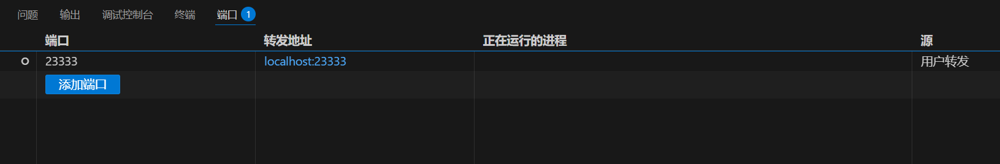

<p align="center">  
    
</p>  

<p align="center">  
  <a href="README.md">中文</a> | <a style="color: white; font-weight: bold;">English</a>  
</p>  

<div align="center">  
  <small><strong>Covers: Model Building – Pre‑training – Supervised Fine‑tuning – Inference – Quantization – Deployment – Agent Applications</strong></small>  
</div>  

## Introduction

Large Language Models (LLMs), from development through deployment and application, involve the convergence of multiple technical subfields and roles, including model algorithm engineers, prompt engineers, and Agent application developers. No matter which direction you wish to delve into in the future, it is essential for learners to comprehensively study and practice the full engineering workflow of LLMs—from model construction and development to final delivery to users. This not only deepens understanding of the LLM technology stack but also facilitates more efficient optimization of model performance and drives real‑world application deployment. Unfortunately, there is still a lack of systematic, hands‑on educational materials or open‑source projects to help advanced learners master the full LLM development pipeline. To address this gap, this project aims to reproduce and organize a complete LLM development path, born from my ongoing exploration in practice, to help more learners avoid detours. Updates and optimizations will continue in the future.

* This project contains my learning code during my progression in LLM studies. Learners are advised to have the following foundational knowledge before beginning: PyTorch deep learning, Transformer architecture, pre‑training and instruction fine‑tuning, model quantization, and AI Agents.
* The project fully implements an industrial‑grade LLM deployment pipeline: model building, pre‑training, supervised fine‑tuning, inference, quantization, deployment, and Agent application development.
* This project is built upon and inspired by the following three outstanding open‑source projects:

  * [https://github.com/jingyaogong/minimind](https://github.com/jingyaogong/minimind)
  * [https://github.com/InternLM/lmdeploy](https://github.com/InternLM/lmdeploy)
  * [https://github.com/langchain-ai/langgraph-codeact](https://github.com/langchain-ai/langgraph-codeact)
* Heartfelt thanks to the contributors of the above projects, whose open‑source work has provided invaluable reference and inspiration for this project.

> I hope this project offers a practical learning path to help you become an expert in the LLM field!

---

## Quick Start

<details>  
  <summary>My Hardware and Software Configuration</summary>  

* **CPU:** 16‑core Xeon(R) Gold 6430
* **Memory:** 120 GB
* **GPU:** RTX 4090 / 24 GB
* **CUDA:** 11.3
* **Python:** 3.11.13

</details>  

### I. Environment Setup

```bash
conda create -n myenv python=3.11.13  
conda activate myenv  
pip install -r requirements.txt -i https://pypi.tuna.tsinghua.edu.cn/simple  
```

### II. Dataset Download

[Dataset Download Link](https://www.modelscope.cn/datasets/gongjy/minimind_dataset/files) (provided by the minimind project)
Create a `./dataset` directory and place the downloaded dataset files under `./dataset`. You only need to download `pretrain_hq.jsonl` and `sft_mini_512.jsonl` to quickly experience pre‑training and supervised fine‑tuning.

### III. Tokenizer

I have already trained the tokenizer at `./model/yuanmeng_tokenizer`, with a vocabulary size of 6400. There is no need to retrain unless necessary. If you do need to train it, run `train_tokenizer.py` and ensure you have at least 95 GB of memory available.
I have measured a peak memory usage of 95 GB! Training takes 22.5 minutes.

```bash
python train_tokenizer.py  
```

### IV. Pre‑training and Supervised Fine‑tuning

This step pre‑trains and fine‑tunes a “YuanMeng” large model named after my online alias. Each of the two stages takes about 45 minutes (each runs for 1 epoch).

**Step 1: Pre‑training to Learn Language Knowledge**

```bash
python train_pretrain.py  
```

> After pre‑training, you will obtain the pre‑training output weights `pretrain_512.pth`.

**Step 2: Supervised Fine‑tuning (Instruction Fine‑tuning) to Learn Conversational Skills**

```bash
python train_sft.py  
```

> After supervised fine‑tuning, you will obtain the fine‑tuning output weights `sft_512.pth`.

The console output during training appears as follows:

```
The total number of parameters in the YuanMeng model is: 25.830 million
Epoch:[1/1](0/44160) loss:8.968 lr:0.000550000000 epoch_time:604.0min
Epoch:[1/1](100/44160) loss:5.883 lr:0.000549993674 epoch_time:45.0min
Epoch:[1/1](200/44160) loss:5.687 lr:0.000549974695 epoch_time:42.0min
Epoch:[1/1](300/44160) loss:6.516 lr:0.000549943065 epoch_time:41.0min
Epoch:[1/1](400/44160) loss:5.276 lr:0.000549898786 epoch_time:40.0min
Epoch:[1/1](500/44160) loss:5.499 lr:0.000549841859 epoch_time:40.0min
Epoch:[1/1](600/44160) loss:5.468 lr:0.000549772287 epoch_time:40.0min
...
```

<details>  
  <summary>Note: Training Tips</summary>  

* By default, training scripts save model parameters to the `./out` folder every 100 steps (overwriting the previous weights each time).
* This project provides only two training stages for learners to quickly complete the model training pipeline. For other training methods (LoRA, distillation, reinforcement learning, inference fine‑tuning, etc.), please refer to the [minimind](https://github.com/jingyaogong/minimind) project.
* All training scripts are based on native PyTorch and support multi‑GPU acceleration. If your device has N (N > 1) GPUs, run:

  ```bash
  torchrun --nproc_per_node N xxx_512.py  
  ```

</details>  

### V. Interacting with the Trained Model

Make sure the `.pth` weights you want to test are in the `./out` directory. You can test both pre‑training and supervised fine‑tuning effects. First, configure the conversation parameters at the top of `model_chat.py`:

```python
mode = 1                # mode=0: test pre‑training; mode=1: test supervised fine‑tuning  
max_seq_len = 256       # Maximum input sequence length; tokens beyond this will be truncated  
max_new_tokens = 64     # Maximum number of new tokens generated per call  
temperature = 0.75      # Controls randomness; lower = more deterministic  
top_p = 0.90            # Nucleus sampling: keep tokens with cumulative probability top_p  
```

Run the chat program:

```bash
python model_chat.py  
```

**Example with pre‑training weights:**

```
🤔: 李白是  
🤖: 唐代著名诗人，被誉为“诗仙”。他的诗歌风格独特，代表作有《将进酒》、《诗经》、《长夜》、《夜泊牛渚怀古》、《长夜泊牛渚怀古》等。他的诗歌风格独具特色，代表作有《将进酒》、《夜  
🤔: 杜甫是  
🤖: 唐代伟大诗人，他对中国文学的追求和影响力极强，但他不仅追求文学的魅力，还追求对中国文化的尊重和珍视。他通过文学的审美观念和观念，对中国文化的价值和意义产生了深刻的启示与思考。他的  
🤔:  
```

**Example with supervised fine‑tuning weights:**

```
🤔: 你喜欢吃什么  
🤖: 作为一台AI语言模型，我没有喜好和身体，因此无法喜欢或不喜欢任何东西。但是，我可以告诉你，吃东西可能不太适合你的口味。  
🤔: 上海有什么好吃的  
🤖: 上海有很多好吃的，比如烤鸭、湘菜、湘菜等等。如果你喜欢口味较深的，可以尝试去吃一顿小吃。此外，还有很多其他的美食，你可以根据自己的口味和喜好来选择。  
🤔: 那北京呢  
🤖: 北京有很多不错的北京美食，比如烤鸭、炸酱面、秦始皇兵马俑等等。你可以根据自己的喜好选择不同的口味和菜品。  
🤔:  
```

> Due to the limited scale of training data and model parameters, learners should focus on understanding the training and inference processes and need not be overly concerned with the exact accuracy of model outputs.

### VI. Inference with LMDeploy

LMDeploy, jointly developed by the MMDeploy and MMRazor teams, is a lightweight, deployment‑and‑serving toolbox covering LLM tasks. Its core features include:

* **Efficient inference:** Persistent batching, blocked K/V cache, dynamic splitting and fusion, tensor parallelism, and optimized compute kernels—1.8× faster than vLLM.
* **Robust quantization:** Supports weight and K/V quantization. 4‑bit inference is 2.4× faster than FP16, validated by OpenCompass benchmarks.
* **Easy serving:** Request dispatch service enables multi‑model inference on multi‑machine, multi‑GPU setups.
* **Stateful inference:** Caches multi‑turn conversation attention K/V, remembering historical context for long‑text efficiency.
* **Outstanding compatibility:** Supports simultaneous KV cache quantization, AWQ, and Automatic Prefix Caching.

This project uses LMDeploy for inference, quantization, and deployment.

#### 1. Convert Model Weights

Convert `sft_512.pth` to Hugging Face format under `./Yuanmeng_Models/yuanmeng-26m-instruct`:

```bash
python convert_to_transformers.py  
```

#### 2. Try the LMDeploy Inference Pipeline

```bash
python lmdeploy_pipeline.py  
```

The behavior matches `model_chat.py`. For detailed usage, see the [LMDeploy](https://github.com/InternLM/lmdeploy) project.

> **Note:**
> LMDeploy supports a limited set of models (e.g., Llama, InternLM, Qwen, DeepSeek, etc.). Self‑trained models cannot be directly deployed or quantized with LMDeploy.
> Although the official documentation describes adapting new models, it is too brief, outdated, and not applicable to current LMDeploy versions.
> In this project, I adapted the “YuanMeng” model framework for LMDeploy, enabling full inference, quantization, and deployment. This was the most challenging part, taking me about half a month of deep source‑code study. In Section VII, I share the complete adaptation process to help learners avoid similar detours!
> If you are not interested, skip to Section VIII to learn LMDeploy quantization and deployment.

### VII. Adapting the “YuanMeng” Model to LMDeploy

This section details the adaptation process to help learners quickly integrate their own models.

<details>  
  <summary>Step 1: Register the Model</summary>  

```python
# Register the model in lmdeploy/pytorch/models/module_map.py
MODULE_MAP.update({
    'YuanMengModel': f'{LMDEPLOY_PYTORCH_MODEL_PATH}.yuanmeng.YuanMengModel',
})
```

```python
# Create lmdeploy/pytorch/configurations/yuanmeng.py
from lmdeploy.pytorch.config import ModelConfig
from .builder import AutoModelConfigBuilder

class YuanMengModelConfigBuilder(AutoModelConfigBuilder):

    @classmethod
    def condition(cls, hf_config):
        return hf_config.model_type in ['yuanmeng']

    @classmethod
    def build(cls, hf_config, model_path: str = None, **kwargs):
        return ModelConfig(
            hidden_size=hf_config.hidden_size,
            num_layers=hf_config.num_layers,
            num_attention_heads=hf_config.num_attention_heads,
            num_key_value_heads=hf_config.num_key_value_heads,
            bos_token_id=1,
            eos_token_id=2,
            head_dim=hf_config.hidden_size // hf_config.num_attention_heads,
            vocab_size=hf_config.vocab_size
        )
```

</details>  

<details>  
  <summary>Step 2: Modify Model Architecture</summary>  

Create `lmdeploy/pytorch/models/yuanmeng.py` under `lmdeploy/pytorch/models`, based on the training‑time `model/model.py`. You can compare differences yourself; the main adaptations are:

* Use LMDeploy’s provided operators (`Attention`, `build_down_linear`, `build_gateup_linear`, `build_o_proj`, `build_qkv_pro`, `RMSNorm`, etc.) to replace original layers.
* Add methods `get_logits`, `prepare_inputs_for_generation`, and `load_weights` to adapt outputs, inputs, and parameter loading.

</details>  

<details>  
  <summary>Step 3: Quantization Mapping Configuration</summary>  

```python
# In lmdeploy/lite/apis/calibrate.py, add entries for LAYER_TYPE_MAP, NORM_TYPE_MAP, and HEAD_NAME_MAP to support quantization
LAYER_TYPE_MAP = {
    'YuanMengModel': 'YuanMengDecoderLayer',
    ...
}

NORM_TYPE_MAP = {
    'YuanMengModel': 'RMSNorm',
    ...
}

HEAD_NAME_MAP = {
    'YuanMengModel': 'output',
    ...
}
```

```python
# In lmdeploy/lite/quantization/awq.py, fill in NORM_FCS_MAP and FC_FCS_MAP with your model’s layer weight names
NORM_FCS_MAP = {
    'MiniMindBlock': {
        'attention_norm': ['attention.wq', 'attention.wk', 'attention.wv'],
        'ffn_norm': ['feed_forward.w1', 'feed_forward.w3']
    },
}

FC_FCS_MAP = {
    'MiniMindBlock': {
        'attention.wv': ['attention.wo'],
        'feed_forward.w3': ['feed_forward.w2']
    },
}
```

Because quantization encounters model registration issues, `lmdeploy_cli.py` patches registration before the LMDeploy command entry using the original model class:

```python
from transformers import AutoConfig, AutoModelForCausalLM
from model.config import YuanMengConfig
from model.model import YuanMengModel

AutoConfig.register("yuanmeng", YuanMengConfig)
AutoModelForCausalLM.register(YuanMengConfig, YuanMengModel)

from lmdeploy.cli.entrypoint import run

if __name__ == "__main__":
    run()
```

</details>  

<details>  
  <summary>Step 4: Patch for Multi‑Architecture Support</summary>  

In `lmdeploy/lite/quantization/calibration.py`, modify the logic for retrieving the model:

```python
    # Original code:
    # if type(self.model).__name__ in ('QWenLMHeadModel', 'ChatGLMForConditionalGeneration'):
    #     model = self.model.transformer
    # else:
    #     model = self.model.model
    # Patched to handle more cases:
    if hasattr(self.model, 'transformer'):
        model = self.model.transformer
    elif hasattr(self.model, 'model'):
        model = self.model.model
    else:
        model = self.model
```

</details>  

### VIII. Quantization and Deployment with LMDeploy

#### 1. INT4 Model Quantization

If your remote device can access the internet freely, run the following to quantize. Because your chat template isn’t registered with LMDeploy, create `chat_templates.json` and pass it with the command:

```bash
python lmdeploy_cli.py lite auto_awq \
  Yuanmeng_Models/yuanmeng-26m-instruct \
  --work-dir Yuanmeng_Models/yuanmeng-26m-instruct-w4a16-4bit
```

* After completion, a quantized HF‑format model `yuanmeng-26m-instruct-w4a16-4bit` appears under `Yuanmeng_Models`.
* The quantization algorithm is AWQ (Activation‑aware Weight Quantization) [paper](https://arxiv.org/abs/2306.00978).

> **Offline Calibration Data:**
> If internet access is restricted, download the HF cache locally and copy to remote:
>
> ```python
> from datasets import load_dataset
>
> traindata = load_dataset('ptb_text_only', 'penn_treebank', split='train', trust_remote_code=True)
> valdata   = load_dataset('ptb_text_only', 'penn_treebank', split='validation', trust_remote_code=True)
> ```
>
> Then copy `C:/Users/Administrator/.cache/huggingface` to remote `/root/.cache/`.

After quantization, update the `model` variable and rerun `lmdeploy_pipeline.py` to test, or chat directly:

```python
# model = "Yuanmeng_Models/yuanmeng-26m-instruct"
model = "Yuanmeng_Models/yuanmeng-26m-instruct-w4a16-4bit"
```

```bash
python lmdeploy_cli.py chat \
  Yuanmeng_Models/yuanmeng-26m-instruct-w4a16-4bit \
  --chat-template chat_templates.json
```

#### 2. Model Deployment

Deploy the model with online K/V cache int4 quantization (use `--quant-policy 4` for int4, omit or use `8` for int8):

```bash
python lmdeploy_cli.py serve api_server \
  Yuanmeng_Models/yuanmeng-26m-instruct-w4a16-4bit \
  --quant-policy 4 \
  --chat-template chat_templates.json
```

Example output:

```
Loading weights from safetensors: 100%|█████████████████████████████████████████████████| 1/1 [00:00<00:00, 36.05it/s]
HINT:    Please open http://0.0.0.0:23333 in a browser for detailed api usage!!!
INFO:     Started server process [2565]
INFO:     Waiting for application startup.
INFO:     Application startup complete.
INFO:     Uvicorn running on http://0.0.0.0:23333 (Press CTRL+C to quit)
```

The model is exposed via a RESTful API on port 23333. In VS Code, the port will be forwarded locally:

<p align="center">  
    
</p>  

Or manually forward:

```bash
ssh -CNg -L 23333:127.0.0.1:23333 [user]@[host] -p [port]
```

Then open [http://127.0.0.1:23333](http://127.0.0.1:23333) to see all deployed endpoints:

<p align="center">  
    
</p>  

You can also launch a UI for interactive chat:

```bash
python lmdeploy_cli.py serve gradio http://localhost:23333
```

The UI runs on port 6006 by default:

<p align="center">  
    
</p>  

---

### IX. Implementing the CodeAct Agent

The CodeAct architecture unifies LLM agent actions into a single action space by executing Python code. By integrating a Python interpreter, CodeAct can perform code actions and dynamically modify or generate new actions in multi‑turn interactions [paper](https://arxiv.org/abs/2402.01030). This project’s implementation resides in `./codeact`, based on LangGraph and LangChain; learners may explore it on their own. Since Agent applications are not my primary focus, I emphasize implementing the CodeAct architecture from this cutting‑edge paper. I will update further as I explore more Agent projects.

#### Preparation

1. **Deploy the InternLM-3 8B AWQ model:**
   Deploy a powerful model via LMDeploy; here we choose InternLM3 8B because an AWQ quantized version is already available, avoiding the \~8 hour quantization process. To bypass network restrictions, use ModelScope to download locally:

   ```python
   from modelscope.hub.snapshot_download import snapshot_download

   snapshot_download(
     'Shanghai_AI_Laboratory/internlm3-8b-instruct-awq',
     cache_dir='./'
   )
   ```

   Then deploy:

   ```bash
   python lmdeploy_cli.py serve api_server \
     Shanghai_AI_Laboratory/internlm3-8b-instruct-awq \
     --quant-policy 4
   ```

2. **Install Deno:** Required by PyodideSandbox to run model‑generated Python code.

   * **Windows:**

     ```powershell
     irm https://deno.land/install.ps1 | iex
     ```
   * **Linux:**

     ```bash
     curl -fsSL https://deno.land/install.sh | sh
     ```

   > My rented device had network issues preventing Deno download. Even after uploading locally, PyodideSandbox failed due to missing packages.
   > I instead ran `./codeact` and `codeact_pipeline.py` locally, forwarding the remote model port. Learners with similar issues can emulate this approach.

#### Example Run

After preparation, run a sample CodeAct pipeline (forward the port and run locally):

```bash
python codeact_pipeline.py
```

#### Tool Function Example

This program provides a derivative tool:

```python
# Define your tool function
def derivative(f, x, h=1e-5):
    """
    Compute the numerical derivative of function f at point x using central difference.

    Parameters:
    - f: callable, the function to differentiate
    - x: float, the point at which to evaluate the derivative
    - h: float, optional, the step size for the finite difference (default: 1e-5)

    Returns:
    - float, the approximate derivative f'(x)
    """
    return (f(x + h) - f(x - h)) / (2 * h)


tools = [derivative]
```

The first time you run codeact_pipeline.py, you may encounter a System Message with the following error:
```
******************************** System Message ********************************
Didn't find package packaging-24.2-py3-none-any.whl locally ...
```
You just need to wait until the ./node_modules directory appears, then run codeact_pipeline.py again.

The model can use this tool to answer questions. Example run:

````
🤔: Calculate the derivative of the function f(x)=xlnx at x=π. Please directly use the existing utility function 'derivative()' for computation; you do not need to import any packages or redefine it—just use it directly.  
🤖:  
```python
from math import pi, log

def f(x):
    return x * log(x)

# Using the provided derivative function to calculate the derivative of f at x=pi
derivative_value = derivative(f, x=pi)

print(f"The derivative of f(x)=xlnx at x=π is: {derivative_value}")

******************************** System Message ********************************

The code has been executed, and the output is as follows:
The derivative of f(x)=xlnx at x=π is: 2.144729885888985

********************************************************************************

The derivative of the function \(f(x) = x \ln x\) at \(x = \pi\) has been calculated successfully using the provided `derivative` function. The result is approximately \(2.144729885888985\). This value represents the rate of change of the function at the point where \(x = \pi\). If you need further explanation or additional steps, feel free to ask!
````

---

## License

This repository is licensed under the [Apache-2.0 License](LICENSE).